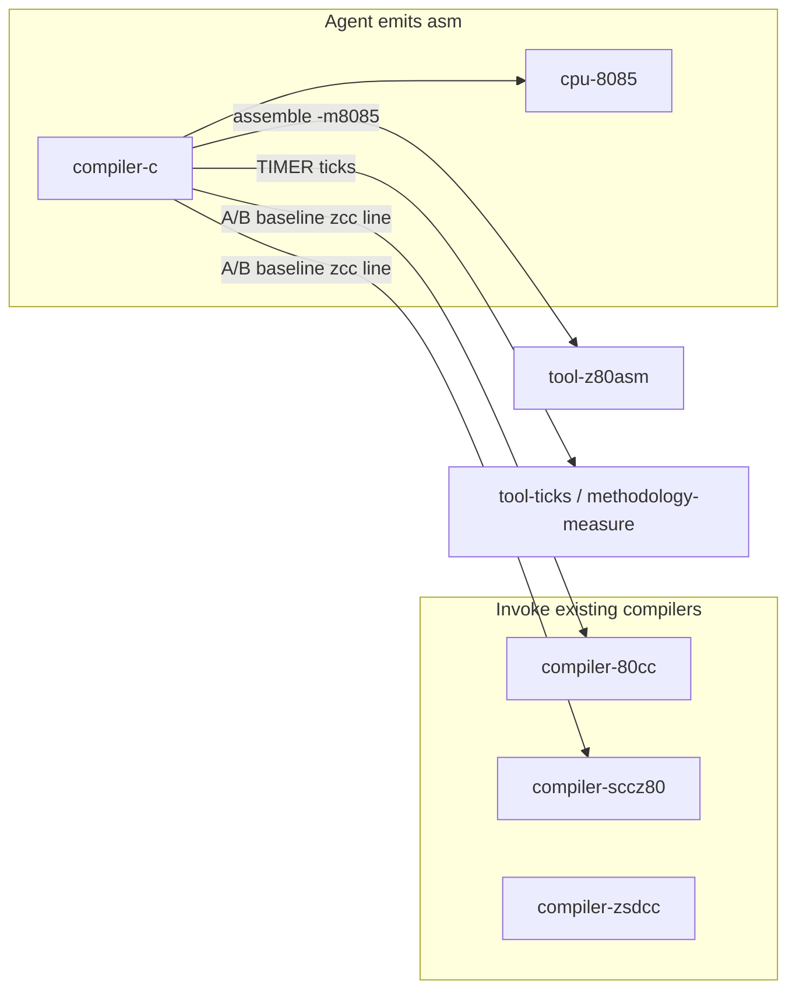

# compiler-c — Agent C90 → 8085 Codegen Skill

| Field | Value |
|-------|--------|
| **Title** | Design: `compiler-c` skill for 8085-skills |
| **Author** | placeholder |
| **Date** | 2026-09-18 |
| **Status** | Approved |
| **Repo** | `/data/8085-skills` (pack); facts from `/data/z88dk` |
| **Eventual published path (after approval)** | `/data/8085-skills/compiler-c-design.md` |

This document is **not** the skill. After approval it lands at the repo root, then is implemented as `.agents/skills/compiler-c/SKILL.md`. The skill is **stand-alone**: it states the 8085 C lowering rules; it does not send the agent to other design records.

---

## Overview

Grok agents in this pack already know C, and they already have **`cpu-8085`** (ISA, Zilog mnemonics, stack-only locals, extended ops). They do **not** have a compact, 8085-specific **C lowering + ABI** card. Today they either invoke **`compiler-80cc` / `compiler-sccz80`** (how to run `zcc`) or they invent Z80-shaped frames (`ix+d`, `exx`, `sbc hl,de`) that are illegal or slow on 8085.

This design adds **one** skill, **`compiler-c`**, whose job is: take **ISO C90** (plus the z88dk extensions the source actually uses) and emit **optimal Intel 8085 assembly in Zilog mnemonics** that **`z88dk-z80asm -m8085`** assembles. The agent **is** the compiler. It is not a user manual for `z88dk-80cc`.

The skill distills only what a C-fluent agent would get wrong on this machine: register roles (HL is the bus), 8085 parking (BC/DE only; 8-bit park in C), stack-relative frames (`ld de,sp+*`), classic z88dk calling convention so generated code can link `libsrc/l/sccz80/7-8085` and math32/math16, helper clobber (arithmetic `l_mult` / `l_div` / `l_long_*` / float kill BC and DE; peephole `l_gint*sp` do not), SMALLC variadic `A` = arg-word count, and an A/B loop against `zcc +test -clib=8085` 80cc/sccz80 TIMER rows.

---

## Background & Motivation

### Current state

| Skill | What it is | What it is not |
|-------|------------|----------------|
| `cpu-8085` | Opcode map, flags K/V, extended-op cookbook, stack-only rule | C types, ABI, register allocation for C |
| `compiler-80cc` | How to **invoke** 80cc (`-compiler=80cc`); no `-fframe-pointer` on 8085 | How an agent should lower C |
| `compiler-sccz80` | sccz80 flags, copt on **compiler** output, `7-8085` runtime location | Agent codegen |
| `compiler-zsdcc` | zsdcc / `__sdcccall`; **Z80-class**, not classic 8085 | 8085 product path |
| `tool-z80asm` / `tool-ticks` / `methodology-measure` | Assemble, time, A/B | Language lowering |

80cc is the quality **oracle** (measured TIMER), not a document the skill should open. An agent that bulk-loads 80cc allocator internals (`ir_alloc`, ranged residency) will cargo-cult Z80 homes onto 8085. The skill states the 8085 consequences only.

### Pain points

1. **Z80 muscle memory.** Agents emit `ix+d`, `exx`, native `djnz`/`jr` as 2-byte, `sbc hl,de`, `ld (de),l` as a real op, or `pop af` as a return address. `cpu-8085` already forbids these; a C skill must **refuse them at the ABI/frame layer**, not only at the mnemonic layer.
2. **Wrong “8085 has no `ex de,hl`”.** gbz80 lacks XCHG. **8085 has native `ex de,hl` (4T).** The skill must say so.
3. **HL as a variable home.** Textbook allocators park live ints in “any register.” On this ISA HL is the ALU/address bus. Homing a C local in HL across a deref or `add hl,de` is a miscompile waiting to happen.
4. **Frame pointer on 8085.** `src/80cc/main.c` forces `c_framepointer_is_ix = -1`. There is no IX. Agents still pass `-fframe-pointer` or emit `push ix`.
5. **Helper calls vs parking.** On Z80, index/alt homes can survive `l_mult`. **8085 has no IX/IY/exx.** **Arithmetic** helpers (`l_mult`, `l_div`, `l_long_*`, float) clobber **HL, DE, BC, A, F**. Peephole stack helpers such as `l_gint1sp` **preserve DE/BC** — but the agent should **open-code** `ld de,sp+*` rather than call them. Unknown C calls still clobber everything.
6. **No optimisation definition.** “Optimal” without ticks-first + a named A/B recipe produces pretty but slower asm than 80cc’s 8085 lowerer (which already uses `ld de,sp+*`, `sub hl,bc`, `jp k`).

### Why a skill (not “just call 80cc”)

The user goal is **agent-as-compiler**: standard C in, 8085 asm out, competitive with or better than 80cc/sccz80 on TIMER. That is a different trigger than “debug `-compiler=80cc`.” Keeping both skills avoids description collision.

---

## Goals & Non-Goals

### Goals

1. One auto-invoked skill so a prompt like **`/compiler-c`**, “you emit the asm”, “hand-lower this C to 8085”, or “do not run 80cc as the compiler” loads **`compiler-c`** (and then **`cpu-8085`** for ISA). Ordinary “invoke zcc/80cc to compile this C” work must **not** load it. A/B recipes that **name** `zcc +test -clib=8085 -compiler=80cc` as the **oracle** **must still load it** when the agent is the emitter (K4).
2. Emit **Zilog** assembly that **`z88dk-z80asm -m8085`** accepts in **normal** (synthetics-on) mode, without relying on `@__z80asm__*` helpers for the hot path.
3. Match **classic z88dk 8085 ABI** when the output must **link** CRT, `l_*` helpers, or math32/math16.
4. Define **optimal** as **TIMER ticks first, code size second**, with a mandatory A/B against published `+test -clib=8085` recipes.
5. State **essential 8085 C-lowering facts** in the skill body. Do not send the agent to 80cc design records, allocator vocabulary, or file-by-file plans.
6. Index the skill in `AGENTS.md`, root `README.md`, and `.agents/README.md`.

### Non-goals

1. **Not** a replacement for `compiler-80cc` / `compiler-sccz80` / `compiler-zsdcc` (invoke, flags, copt, patch pins).
2. **Not** a second CPU skill. No `cpu-z80`, `cpu-8080`, gbz80, Z180, Z80N.
3. **Not** an opcode table. That stays in `cpu-8085/references/opcodes.md`.
4. **Not** a port of 80cc’s IR, `ir_alloc`, copt `80cc_rules.1`, or DESIGN_INDEX live gates.
5. **Not** C99/C11 as a language. v1 **ingests** `//` comments and implicit-int `main()` as **bench input sugar** only (K20). VLAs, mixed decls, designated initializers stay refused. `long long`, `_Float16`, `__z88dk_*` only when the source uses them.
6. **Not** newlib / zsdcc ABI (`__sdcccall(1)`). Classic 8085 only.
7. **Not** `.agents/scripts/` in this pack (those live in the z88dk tree).
8. **Not** running `z88dk-copt` on agent-emitted (hand-written) asm — house rule.
9. **Not** inventing 8085 opcodes `cpu-8085` forbids, even if z80asm expands them.

---

## Key Decisions

| # | Decision | Rationale |
|---|----------|-----------|
| K1 | **Skill name: `compiler-c`.** YAML `name:` = directory `.agents/skills/compiler-c/`. | Sits next to `compiler-80cc` / `compiler-sccz80`. User-recommended name. Alternative `codegen-c-8085` is more precise but splits the `compiler-*` family and is a worse `/compiler-c` trigger. |
| K2 | **One skill, not a split (ABI vs lowering).** | An agent compiling one function needs both in one load. A second card would double-read and fight the context budget. Optional later: `references/abi.md` if the body grows past ~400 lines. |
| K3 | **SKILL.md holds rules + tables; no opcode copy; stand-alone (no 80cc design-record pointers).** Short `references/` only if a worked lowering (e.g. sieve) or a long ABI example is needed **after** the first implementation. | Matches pack layout (`cpu-8085` already owns opcodes). The skill must be usable without opening 80cc docs. |
| K4 | **Role: agent-as-compiler, not “run zcc as the compiler.”** YAML positives: `/compiler-c`, “you emit the asm”, “hand-lower”, “do not run 80cc as the compiler”. Negatives: **invoke** 80cc/sccz80/zcc **as the compiler** (“invoke zcc to compile”, “rebuild 80cc”, edits under `src/80cc`). **Do not list `+test`, `-clib=8085`, or `-compiler=80cc`/`-compiler=sccz80` as exclusion tokens** — those strings appear in intended emit+A/B prompts (K21 copies the readme **oracle** line). Naming `-compiler=80cc` as the quality **oracle** still loads **`compiler-c`** when the agent emits. | `.agents/README.md` requires **narrow** descriptions. Hosts that score the whole `description:` would skip this skill on “emit sieve; A/B with `zcc +test -clib=8085 -compiler=80cc`” if those flags were banned. `compiler-80cc` still owns `src/80cc` and “invoke 80cc”. |
| K5 | **Language: ISO C90 core.** z88dk attributes (`__smallc`, `__z88dk_fastcall`, `__z88dk_callee`) and extra types (`long long`, `_Float16`) only when present in the source. VLAs / mixed decls / designated initializers stay refused. | Goal text says standard C90. Bench sugar is K20, not a C99 promise. |
| K6 | **One calling convention: classic sccz80/80cc SMALLC** (not STDC, not `__sdcccall(1)`), **in every emission mode.** Fastcall/callee only when the **prototype** says so. | `c_use_r2l_calling_convention` defaults **NO**; `declparse.c` then sets `SMALLC`. Library headers use `__smallc`. A closed program that invents a register-only ABI will not mix with a later classic link. |
| K7 | **Two image shapes, not two ABIs:** (1) **module for `zcc +test`** (default for benches: CRT, TIMER labels, `_main`); (2) **complete image** with a tiny `start` for demos that never use `+test`. | TIMER A/B needs `+test` CRT. K6 ABI is unchanged in both shapes. |
| K8 | **8085 register model for C: HL and A are the bus; 16-bit parking is BC and DE; 8-bit parking is C (not A, not L in HL).** Never home a C local in HL/A across an op that needs the bus. No IX/IY/exx homes. | 8085 (`main.c` pins `c_framepointer_is_ix = -1`, `c_notaltreg = 1`). A is the 8-bit ALU port. |
| K9 | **Frame pointer is impossible. Stack-relative only.** Prefer `ld de,sp+*` / `ld hl,(de)` / `ld (de),hl` (point at `cpu-8085`, do not repeat the tutorial). | 80cc `IS_8085()` paths in `ir_lower_regcache.inc.c`. |
| K10 | **Substitute Z80-only idioms, but `ex de,hl` is legal and cheap (4T).** Use 8085 extended ops instead of IX and instead of `sbc hl,de`. | gbz80 lacks `ex de,hl`; 8085 does not. Tree: `CPU_HAS_SUB_HL_BC`, `CPU_HAS_LD_HL_IND_DE`, `CPU_HAS_JP_K`, `CPU_HAS_SRA_HL` in `src/80cc/define.h`. |
| K11 | **Helper clobber is per family, not “any `l_*`”.** (1) Arithmetic/float/i64: `l_mult`, `l_div` / `l_div_u`, `l_long_*`, `l_f32_*` / FA — spill **BC, DE, HL, AF**. (2) Peephole stack helpers (`l_gint*sp`): **do not call** from agent code; open-code `ld de,sp+*`. If a listing shows one, DE/BC survive (`7-8085/l_gint1sp.asm` `push de`/`pop de`). (3) Unknown C `call` = clobber all parking. | Arithmetic family clobbers `HL\|DE\|BC\|A\|F\|MEM`; IX/alt preserve is vacuous on 8085. Teaching “every `l_*` kills DE” loses ticks vs 80cc. |
| K12 | **Wide (>4-byte) values: memory + helpers (`__i64_acc` / FA), never a fake register file.** 32-bit may live in **DEHL** (DE high, HL low). | `kind_scalar_width` in `ir_kind.h`. |
| K13 | **Optimal = ticks, then size.** A/B against `zcc +test -clib=8085 -compiler=80cc` and `-compiler=sccz80` using the bench’s own `z88dk-classic/readme.txt`. First integer: **sieve**, **fannkuch**. Float: **whetstone / n-body / mandelbrot** with the recipe’s math lib (`--math32` or `--math-mbf32`), never both on a TIMER line. | House rule 6; `methodology-measure`. 80cc 8085 **sorting/qsort does not link** — do not invent that row (`compiler-80cc`). |
| K14 | **Agent asm is hand-written: no copt.** Peephole yourself (`ex de,hl` vs two-byte copies, drop copy-backs). Assemble `-m8085`; prove with listing if a mnemonic might be a helper. | House rules 2 and 4; `tool-copt`, `tool-z80asm`. |
| K15 | **Load `cpu-8085` for ISA; do not restate opcode grids, K-flag loop recipes, or illegal `(de)` stores in full.** One “do not emit” table + pointers. | Context budget in root `AGENTS.md`. |
| K16 | **Feature bits in the tree are `IS_8085()` / `CPU_HAS_*` in `define.h`.** Do not teach a vanished `IR_FEAT_*` / `ir_features_from_cpu()` API. | Avoid sending the agent looking for symbols that are not in `src/80cc/*.c`. |
| K17 | **Default `char` is signed** unless the source/`-unsigned` says otherwise. **`int`/`short`/`enum` = 16-bit. `long` = 32-bit.** Pointers near = 16-bit. Little-endian. Structs packed (member `offset += size`, no ABI alignment holes except bitfield packing in `align_struct()`). | `ir_kind.h`, `declparse.c`, `c_default_unsigned` default 0. |
| K18 | **Do not emit `__sdcccall(1)` or zsdcc objects into an 8085 classic image.** | `compiler-zsdcc`: 8085 classic prefers sccz80/80cc. |
| K19 | **SMALLC variadic: `ld a,N` (or `xor a`) immediately before `call`, N = argument words on the stack.** Do **not** include a stuffed `&__i64_acc` in N. STDC and fastcall do not emit this. Non-variadic calls must not assume A is live. | `ir.h` `CallInfo.is_variadic`; `ir_lower_call.inc.c` (“SMALLC variadic ABI”). Required for `printf`/`scanf` / any `__smallc` varargs. |
| K20 | **Bench input sugar (v1):** ingest `//` comments and implicit-int `main()` so sieve/fannkuch parse. Apply `-DSTATIC` / `-DTIMER` / `-D__Z88DK` **as the C source does**: `STATIC` → **file-scope BSS objects**; `TIMER_*()` → **global labels** at those source points. Stack-only (`cpu-8085`) applies to **automatic** locals and temps, **not** to objects the source declared `static` or file-scope. **Do not rewrite STATIC away** on an A/B line. | `support/benchmarks/sieve/sieve.c` uses `//`, `main()`, `-DSTATIC` BSS, `memset`, `stdio.h`. Changing BSS to stack is a different program than the 80cc/sccz80 TIMER row. |
| K21 | **Normative A/B contract:** copy the **readme** `zcc` line (fannkuch 8085 adds `--opt-code-speed`; sieve does not). **Per-bench mix** — zcc will **not** drop a C `PUBLIC` because an `.asm` also defines it (duplicate symbol). **sieve:** whole-TU asm — hot loops live in `main()`; `PUBLIC _main`; `PUBLIC TIMER_START`/`TIMER_STOP` after `memset`, around the nested loops (not CRT). **fannkuch:** replace **`_fannkuchredux` only**; TIMER stays in C `main`; compile a C copy with `fannkuchredux` **omitted** (or `#if 0` / renamed) plus the asm module. Do not `PUBLIC _main`/`TIMER_*` from that asm. Other benches: whole-TU if the timed region is in `main`; else replace the named hot function and strip it from C. Bind libc from the **preprocessed prototype** (K23). `-m` map; `z88dk-ticks -m8085` **before** the binary. | `sieve.c` has no other C function to replace. Linking `sieve.c` + `PUBLIC _main` asm is a duplicate `_main`. |
| K22 | **`char` / width-1 function return: L only; H is dead.** Caller zero- or sign-extends (frontend CONV). Callee must not spend ticks on `ld h,0`. | `ir_lower.c` “Byte-declared function: the char-return ABI hands back only the low byte (in L)”. |
| K23 | **`volatile` objects live in memory** across sequence points (no BC/DE home that skips a reload). **Do not lower z88dk headers.** Bind the preprocessed **ABI**, not the C builtin spelling: `__z88dk_callee` → `call _foo_callee` (callee pops; no caller pop); `__smallc` without callee → K6 caller-clean `call _foo`; `__z88dk_fastcall` → last arg in HL/DEHL. Classic `string.h` first `#define memset memset_callee`; under `__SCCZ80` (zcc sets this for **both** sccz80 and 80cc) C sees `__builtin_memset` (`__smallc`). That name is **not** a library `PUBLIC` — 80cc **inlines** a const count (`IR_MEMSET`; sieve `memset(flags,0,SIZE)` with `SIZE=8000` is in range) or **redirects** to `memset` / `_memset` (`libsrc/string/c/sccz80/memset.asm` `PUBLIC memset` / `_memset`). **Sieve whole-TU asm:** `EXTERN _memset` (or `memset`), caller-clean SMALLC, **outside** TIMER — or inline the const fill (optional, still outside TIMER). **Never** `EXTERN` / `call __builtin_memset`. Other hosted TUs: follow the preprocessed ABI (`memcpy`/`printf` often `_callee`). Unsigned 16-bit `>>` is `sra hl` then clear H bit 7 (**Z unchanged**). Signed `/` → `l_div`; unsigned `/` → `l_div_u`. | Calling `memset_callee` as caller-clean SMALLC is an ABI bug. Calling `__builtin_memset` from asm is an undefined symbol. |

---

## Proposed Design

### Skill placement and YAML

```text
.agents/skills/compiler-c/SKILL.md
```

Directory name **equals** YAML `name:`. Flat layout (no `compiler/` category folder).

Recommended front matter:

```yaml
---
name: compiler-c
description: >
  Agent-as-compiler: you emit Intel 8085 Zilog assembly from ISO C90 for
  z88dk-z80asm -m8085; do not run 80cc or sccz80 as the compiler. Classic
  SMALLC ABI, stack frames, HL bus / BC-DE parking, 8085 extended ops.
  Use for /compiler-c, "you emit the asm", "hand-lower this C to 8085".
  Do not use when the user wants to invoke 80cc/sccz80/zcc as the
  compiler ("invoke zcc to compile", "rebuild 80cc", edits under
  src/80cc — those are compiler-80cc, compiler-sccz80, tool-zcc).
  Naming zcc +test -clib=8085 -compiler=80cc as the A/B oracle still
  belongs here if the agent emits the asm (harness/oracle, not an
  exclusion).
---
```

**Load order when this skill fires**

1. This skill (ABI, residency, workflow, A/B).
2. **`cpu-8085`** (ISA, extended ops, pitfalls) — already required for any 8085 emit.
3. **Only if linking/timing:** `tool-z80asm`, `tool-ticks`, `methodology-measure`.
4. **Only if the C uses float:** `library-math32` and/or `library-math16` (div = restoring, inv = Newton–Raphson).
5. **Only if writing `libsrc/` files:** `style-libsrc-layout`.
6. **Do not** open `compiler-80cc` unless the A/B **readme `zcc` line** is in doubt. **Do not** open every tool skill. When implementing, add a one-line pointer **from** `compiler-80cc`: hand-emit C → **`compiler-c`**.

### Relationship to existing compiler skills



`compiler-c` **consumes** 80cc as a **quality oracle**, not as the codegen path.

### Machine facts the skill must state (no external design records)

Put these **in SKILL.md**. Do not point at 80cc design files.

| Topic | What the agent must keep |
|-------|---------------------------|
| Bus vs parking | HL (and A) are **bus/scratch**, never a long-lived home. Parking on 8085 = **BC, DE** (and stack). No IX/IY/alt. Two-address ops (`add hl,rp`) constrain staging. |
| Allocation | **Do not port 80cc’s allocator.** Keep the hottest 16-bit values in BC or DE over a **clobber-free window**; spill across calls/helpers; do not fight HL. |
| Helpers | Arithmetic family (`l_mult`, `l_div`, shifts, `l_long_*`, float, i64): clobber **A F BC DE HL MEM** on 8085. Index/alt “preserve” is **vacuous**. **Not** all `l_*`: `l_gint*sp` preserve DE/BC — **open-code** stack access. Unknown C calls = everything. |
| ISA vs Z80 | **Substitute** Z80-only forms. 8085 **has** `ex de,hl`. 8085 **does not** have `(ix+d)`, IX/IY, `exx`, `djnz` (opcode `10` is `sra hl`), native 2-byte `jr` (opcode `18` is `rl de`), `sbc hl,de`. Capability list: `CPU_HAS_*` in `define.h`. There is no live `IR_FEAT_*` API in `src/80cc/*.c`. |
| Widths | Kind is authoritative; width follows: char 1, int/short/ptr 2, long 4, long long 8. Float width is **maths mode** (`c_fp_size`), not a fixed C type. |
| Wide values | Values wider than 4 bytes go through **FA / `__i64_acc` + helpers**, not registers. 32-bit may use DEHL. |
| Index regs | IX/IY are a **Z80** story. On 8085 they are N/A. Do not allocate “idx2”. |
| Frame | **8085 already forced** `c_framepointer_is_ix = -1` in `main.c`. Never `-fframe-pointer` on 8085. |
| copt | 80cc may run **copt on compiler output**. Agent output is **library-style hand asm** → **no copt**. |
| DE | Do not invent a “DE cache” that disagrees with DE as a **home**. Do not share epilogues across functions unless you measured it. |
| Pointer param | A stepped pointer parameter **may live in BC**. Loop index/pointer in BC, data pointer in DE, HL free for `(hl)` / ALU. |
| `jr` | On 8085, `jr` in **normal** z80asm is a **3-byte `jp`**. Cost it as `jp`. |

**What 80cc / this pack already refuse — agent must too**

| Refuse | Why |
|--------|-----|
| IX, IY, `(ix+d)`, `add iy,de` | No index registers (`cpu-8085`) |
| `exx`, AF'/BC'/DE'/HL' | No alt bank (`c_notaltreg` on 8085) |
| Native `djnz` | Opcode `10` = `sra hl` |
| Native 2-byte `jr` / `jr cc` | Opcode `18` = `rl de`; z80asm may **synthesise `jp`** — legal source, **not** 2-byte |
| `sbc hl,de` / `sbc hl,bc` as a chip op | No `CPU_HAS_SBC_HL` on 808x; z80asm may emit **`call __z80asm__*`** — avoid on the hot path |
| `sub hl,de` as a chip op | 8085 DSUB is **HL−BC only** (`CPU_HAS_SUB_HL_BC`) |
| `ld (de),r` for r ≠ A, or `ld (de),n` | Illegal; only `ld (de),a` / `ld (de),hl` / `ld a,(de)` / `ld hl,(de)` |
| `pop af` to hold a return address or a faithful 16-bit temp | F bit 3 hardwired 0 (`$FFFF`→`$FFF7`) — `cpu-8085` |
| BSS/static scratch for **automatic** locals/temps | Stack-only rule — `cpu-8085`. **Not** objects the C source declared `static` / file-scope (K20: `-DSTATIC` BSS stays BSS on A/B) |
| `-fframe-pointer` on `-clib=8085` | `compiler-80cc`; no IX |
| Intel mnemonics in emitted sources | House rule 4; z80asm Intel forms are **compat only** |
| zsdcc / `__sdcccall(1)` objects in classic 8085 links | `compiler-zsdcc`, `library-classic` |

**What 80cc’s 8085 lowerer already does — steal the shapes, not the C**

Verified in `ir_lower_*.inc.c` / `define.h`:

- Stack word: `ld de,sp+N` + `ld hl,(de)` (park DE with `push de`/`pop de` when DE is live).
- Signed 16-bit compare fused with branch: `ld bc,de` / `sub hl,bc` / `jp k` or `jp nk`. **K after DSUB is signed word LT** (`CPU_HAS_JP_K` / `define.h`) and is valid **only immediately after** `sub hl,bc`. Unsigned stays byte-wise / carry; do not pay DSUB+park for unsigned.
- `sra hl` for signed `>>` on 16-bit (`CPU_HAS_SRA_HL`). Unsigned `>>`: `sra hl` then force H bit 7 clear (**Z unchanged** — `cpu-8085`).
- Counted loops: **not** C `n--`. Use `cpu-8085` trip-count identities (K after `dec rp` means the pair became **−1**, not 0) or `dec bc / inc b / inc c`. C `n == 0` needs a Z-writing test.
- `rl de` + `add hl,hl` for 32-bit shifts (same as math32 8085 cores).
- Offsets on `ld de,sp+*` / `ld de,hl+*` are **unsigned 0…255**. Wider offsets: `ld hl,nn` / `add hl,sp`.

### Agent workflow

```mermaid
sequenceDiagram
  participant U as User C90
  participant A as Agent compiler-c
  participant CPU as cpu-8085
  participant ASM as z80asm -m8085
  participant T as z88dk-ticks -m8085
  participant B as 80cc / sccz80 baseline

  U->>A: C translation unit
  A->>A: Parse C90; data model; image shape (K7)
  A->>A: Plan residency BC/DE vs stack slots
  A->>CPU: Legal ops, timings, stack sequences
  A->>A: Emit Zilog asm (SECTION, PUBLIC)
  A->>ASM: Assemble; reject helpers / illegal ops
  alt +test module bench
    A->>B: Same +test -clib=8085 TIMER line
    A->>T: TIMER_START..STOP both binaries
    T-->>A: ticks + size
  end
  A->>U: asm + A/B numbers or fail
```

**Step checklist (put in SKILL.md as a short ordered list)**

1. **Ingest.** C90 plus K20 sugar (`//`, implicit-int `main()`). Apply `-DSTATIC`/`-DTIMER` as the source does. Refuse VLAs / mixed decls. Note `__smallc` / `__z88dk_fastcall` / `__z88dk_callee` / `float` / `long`.
2. **Choose image shape (K7).** Default for benches: **module for `zcc +test`**. ABI is always K6.
3. **Data layout.** Sizes, signedness, struct offsets. File-scope/`static` (including `-DSTATIC`) → BSS/data; **automatic** locals/temps → stack only.
4. **Residency plan** per function (see below). Write it in a comment block at the top of the function if the function is hot — helps A/B review.
5. **Lower.** Extended ops; helpers only when inlining loses; spill across clobbers.
6. **Assemble.** `z88dk-z80asm -m8085 -l`. If `.lis` shows `CD …. __z80asm__`, rewrite that op.
7. **A/B (K21).** Copy the readme `zcc` line. **sieve = whole-TU asm**; **fannkuch = `_fannkuchredux` asm + C stub** (TIMER in C). Same `-DSTATIC -DTIMER -D__Z88DK`, **no `-DPRINTF`**. CPU flag **before** the binary: `z88dk-ticks -m8085 bin …`.
8. **Iterate** on the hottest C function (ticks debugger `hotspot on`), not on CRT.

### Register residency (agent-scale, not 80cc `ir_alloc`)

This is the part a C-fluent agent will not invent correctly.

```text
        ┌─────────────────────────────────────────┐
        │  Bus (not homes)                        │
        │    A     — 8-bit ALU, (de)/(bc) byte    │
        │    HL    — 16-bit ALU, (hl), addresses  │
        └─────────────────────────────────────────┘
        ┌─────────────────────────────────────────┐
        │  Parking (homes)                        │
        │    C     — 8-bit local (not A, not L)   │
        │    BC    — loop count / walking pointer │
        │    DE    — 2nd operand / stack cursor / │
        │            32-bit high half             │
        │    Stack — everything else, all temps   │
        └─────────────────────────────────────────┘
```

**Rules**

1. After any op that uses HL as bus, the previous HL value is gone unless you parked it (DE, BC, or stack).
2. Prefer **leaving a stack pointer in DE** and using `ld hl,(de)` / `ld (de),hl` / `ld a,(de)` rather than `ex de,hl` every time — but **`ex de,hl` is allowed** when it wins (4T).
3. One 32-bit live value: **DEHL** (DE=high, HL=low), matching `l_long_*` and math32 fastcall. A **second** 32-bit value: **stack**, never `exx`.
4. **`call` / arithmetic helper:** assume **BC and DE die** (`l_mult`, `l_div` / `l_div_u`, `l_long_*`, float). Reload from slots. Fastcall **result** returns in HL or DEHL — that is a new value, not a preserved home. Unknown C calls clobber all parking. Do **not** call `l_gint*sp`; open-code stack access.
5. Do not use AF as a 16-bit park (`pop af` corrupts bit 3). Do not home an 8-bit local in **A** (bus).
6. Counted 16-bit loops: **do not** map C `n--` / `if (n--)` onto `dec bc / jp nk`. `dec rp` sets **K when the pair becomes −1**, not 0 (`cpu-8085` §5) — that is a **different K** from DSUB’s signed LT. For a known trip count, use the `cpu-8085` pre-dec identity **or** `dec bc / inc b / inc c`. For C `n == 0` / post-decrement-to-zero, use a **Z-writing** test (`or a` / 8-bit `dec` / inner-outer form). Do not copy Z80 `dec bc; jp nz` as if Z were set.
7. **`volatile`:** reload from memory at each sequence point; no BC/DE home that skips a store.

**Suggested comment shape (hot functions only)**

```asm
; residency: i in BC; p in DE; acc via HL; slot n = sp+4 (int x)
```

### Lowering cookbook (pointers, not a second cpu-8085)

SKILL.md should list **C construct → preferred 8085 shape** in one table, each row one line + skill pointer:

| C | Prefer | Point at |
|---|--------|----------|
| Automatic local `int` | Stack slot; `ld de,sp+n` / `ld hl,(de)` | `cpu-8085` § stack |
| `static` / file-scope / `-DSTATIC` | BSS/data as declared; **do not** move to stack on A/B | K20 |
| `x + y` (16) | HL += DE or BC (`add hl,de`) | bus rule |
| `x - y` (16) | `sub hl,bc` (move y to BC) | extended |
| `x == y` / `!=` | `sub hl,bc` / `jp z` | extended |
| signed `<` / `>=` (16) | `sub hl,bc` then **immediately** `jp k` / `jp nk` | DSUB K = signed LT only; `ir_lower_cmp.inc.c` |
| unsigned `<` (16) | byte-wise / carry — **not** DSUB+`jp k` | same |
| `p->field` | `ld de,hl+off` (u8) then `(de)` | LDHI |
| `s << 1` (16) | `add hl,hl` | — |
| signed `s >> 1` | `sra hl` | **Z unchanged** |
| unsigned `u >> 1` | `sra hl`; `ld a,$7f` / `and h` / `ld h,a` | **Z unchanged**; `cpu-8085` |
| `long` `<< 1` | `add hl,hl` / `rl de` | 32-bit |
| `int * int` | inline shift-add or `call l_mult` (HL = DE × HL) | `7-8085/l_mult.asm`; K11 |
| signed `int / int` | `call l_div` (HL = DE / HL, DE = DE % HL) unless power-of-two | `l_div.asm` |
| unsigned `int / int` | `call l_div_u` | `l_div_u.asm` |
| `long` ops | `l_long_*` or stack 32-bit sequences; restoring div | `7-8085/i32/` |
| `float` `/` | restoring `fsdiv`, not `fsinv`×mul | `library-math32` |
| Counted 16-bit loop | `cpu-8085` trip-count identity **or** `dec bc / inc b / inc c` — **never** C `n--` → `jp nk` | K after `dec rp` = became **−1** |
| C `n == 0` / post-dec to zero | Z-writing test (`or` / 8-bit `dec` / inner-outer) | not K |
| `switch` | compare chain or address table via HL; no `jp (ix)` | — |
| `return` 16-bit | HL; epilogue never `pop af` for retaddr | ABI |
| `return` `char` | L only; H dead; caller extends | K22; `ir_lower.c` |
| `return L` long | DEHL | ABI |
| libc (`memset`, `memcpy`, `printf`, …) | Bind the preprocessed **ABI** + **library** name (`EXTERN _memset` / `memset` on sieve `+test`, caller-clean; `_callee` → callee cleanup). **Never** `call __builtin_memset`. **Do not lower headers** | K23 |
| SMALLC `printf` / varargs | `ld a,word_count` then `call`; stuffed `__i64_acc` **not** in count | K19 |
| `volatile` | memory at each sequence point | K23 |

**Prologue/epilogue (`+test` module, SMALLC, no saved IX)** — same ABI for a complete-image `start` (K6/K7).

```asm
; void f(int a, int b)  /* SMALLC L→R: push a, then b; caller cleans */
; on entry: [sp+0]=ret, [sp+2]=b, [sp+4]=a
; locals: push slots or ld hl,-n / add hl,sp / ld sp,hl
; exit: restore SP; ret  (caller pops args)
```

`__z88dk_callee`: pop args in the epilogue (drop words; `pop af` **only** to discard).  
`__z88dk_fastcall`: last arg already in HL (or DEHL if 32-bit); do not also read it from the stack.

**`ld de,sp+*` vs live DE:** 80cc parks DE (`push de` … `pop de`) when DE is a home. Copy that. Offsets must account for the extra 2 bytes while the push is live.

### C90 subset the skill must specify

**In scope**

- C90 types: `void`, `char`, `short`, `int`, `long`, `float`/`double` (width = selected maths mode), pointers, arrays, structs/unions, enums (size 2).
- Operators, `?:`, comma, casts, usual integer promotions **to 16-bit `int`**.
- `static` / file-scope data in `SECTION bss_compiler` / `data_compiler` (or CRT-default sections when linking via `zcc`).
- `goto`, `switch`, loops, `return`.
- Standard headers **only when linking classic** (`stdio.h`, `string.h`, …) — **do not lower the header**. `EXTERN` the **library** symbol (`_memset`, `_memset_callee`, `_printf`, …) and honour the **preprocessed ABI** (callee vs SMALLC vs fastcall; K23, plus K19 if variadic). C may see `__builtin_memset`; asm must not.
- Bench sugar (K20): `//` comments, implicit-int `main()`, `-DSTATIC` BSS, `intrinsic_label(TIMER_*)`.

**Out of default scope (refuse)**

- C99 as a language: VLA, mixed declarations after statements, designated initializers, compound literals, `stdint.h` as a requirement. (`//` is **ingest-only sugar**, not a C99 promise.)
- Nested functions, statement expressions.
- `__sdcccall(1)`, `--reserve-regs-iy`, IX frames.
- Newlib `FILE*` cores in the same 8085 image (`library-classic` isolation).

**Extensions when the source has them**

| Extension | Lowering |
|-----------|----------|
| `long long` | `__i64_acc` / `l_i64_*`; hidden pointer on return as 80cc `ret_longlong` |
| `_Float16` | `library-math16`; restoring div |
| `__z88dk_fastcall` | last scalar in HL/DEHL |
| `__z88dk_callee` | callee stack cleanup |
| `__smallc` / `__stdc` | L→R vs R→L push order |
| `intrinsic_label(TIMER_*)` | emit the label for ticks |

If float is present and the user did not name a library, **ask or default to IEEE math32** for 8085 classic (`--math32` / `math32_8085`) — **Open Question** vs MBF32, because several published 8085 whetstone rows are `--math-mbf32`.

---

## API / Interface Changes

No z88dk C API change. The “API” is the **skill contract**.

### Assembler output contract

```asm
    SECTION code_compiler      ; or rely on zcc default when the file is a module
    PUBLIC  _foo               ; C name foo → _foo (sccz80/80cc)

    ; Whole-TU mix only (sieve): also PUBLIC _main, TIMER_START, TIMER_STOP
    ; Function-replace mix (fannkuch): PUBLIC _fannkuchredux only —
    ;   do not re-export _main / TIMER_* (those stay in C).

    EXTERN  _memset            ; sieve +test: library entry (also PUBLIC memset)
    ; EXTERN _memset_callee    ; only if the preprocessed ABI is callee
    ; never EXTERN __builtin_memset — not a lib PUBLIC; C-level name only
    EXTERN  l_mult             ; arithmetic helper only if called

_foo:
    ...
    ret
```

- C identifiers: leading `_` as sccz80/80cc.
- Zilog mnemonics, lowercase as in `libsrc/l/sccz80/7-8085/`.
- Four-space indent; blank line only after unconditional `jp`/`jr` when matching math32 style — **or** match the file you are patching. New standalone emit: follow `cpu-8085` math32 style notes.
- No Intel names (`LXI`, `DSUB`, `LDSI`) in agent output.
- `TIMER_START` / `TIMER_STOP`: **only in the TU that contains those macros.** Whole-TU sieve: global labels after `memset(flags,0,SIZE)`, then the nested loops, then `TIMER_STOP` — not around CRT. Function-replace fannkuch: labels stay in C `main`. `intrinsic_label` is not a function call.

### `zcc` integration for A/B (`+test` module)

**Normative checklist (K21)**

1. Copy the **exact** `zcc` line from that bench’s `z88dk-classic/readme.txt` (8085 80cc **sieve** has no `--opt-code-speed`; 8085 80cc **fannkuch** **does**). Do not copy sieve’s line onto fannkuch.
2. **Per-bench mix** (zcc does **not** drop a C `PUBLIC` when an `.asm` also defines it):
   - **sieve → whole-TU asm.** Timed nested loops are **inside `main()`**; there is no other function to replace. `PUBLIC _main` + TIMER labels. `EXTERN _memset` (or `memset`), caller-clean SMALLC, **outside** TIMER — or inline the const fill. Do not `call __builtin_memset`.
   - **fannkuch → replace `_fannkuchredux` only.** TIMER stays in C `main` around `fannkuchredux(n)`. Compile a **C stub** (copy of the TU with `fannkuchredux` omitted / `#if 0` / renamed) **plus** the asm. Do not define `_main` or `TIMER_*` in the asm.
   - Other benches: whole-TU if the TIMER region is in `main`; else strip the named C function and keep TIMER in C.
3. Bind libc from the preprocessed **ABI** and the **library** `PUBLIC` (K23). Sieve: `_memset`. Not `__builtin_memset`.
4. `-m` map file. `z88dk-ticks -m8085` **before** the binary. `-start TIMER_START -end TIMER_STOP`. **No `-DPRINTF`** for published ticks.
5. 80cc Z80 recipes add `-fframe-pointer`; **8085 recipes must not**.

```bash
# Baseline — copy from support/benchmarks/sieve/z88dk-classic/readme.txt
zcc +test -clib=8085 -compiler=80cc -vn -O2 -DSTATIC -DTIMER -D__Z88DK \
  sieve.c -o sieve-80cc.bin -lndos -m
zcc +test -clib=8085 -vn -O2 -DSTATIC -DTIMER -D__Z88DK \
  sieve.c -o sieve-scc.bin -lndos -m

# sieve: whole-TU agent asm (do NOT also pass sieve.c — duplicate _main)
zcc +test -clib=8085 -vn -DSTATIC -DTIMER -D__Z88DK \
  sieve_agent.asm -o sieve-agent.bin -lndos -m

z88dk-ticks -m8085 sieve-agent.bin -x sieve-agent.map \
  -start TIMER_START -end TIMER_STOP -counter 9999999999
```

Fannkuch 8085 80cc (readme — **include** `--opt-code-speed`):

```bash
# Baseline
zcc +test -clib=8085 -compiler=80cc -vn -DSTATIC -DTIMER -D__Z88DK \
  -O2 --opt-code-speed fannkuch.c -o fannkuch.bin -lndos -m

# Agent: C stub without fannkuchredux + asm module (TIMER stays in C main)
zcc +test -clib=8085 -vn -DSTATIC -DTIMER -D__Z88DK \
  -O2 --opt-code-speed fannkuch_stub.c fannkuchredux.asm \
  -o fannkuch-agent.bin -lndos -m
```

---

## Data Model Changes

No repo schema. **C data model the agent must emit:**

| Type | Size (bytes) | Notes |
|------|-------------:|-------|
| `char` / `signed char` | 1 | Default **signed** (`c_default_unsigned` is 0 unless `-unsigned`) |
| `unsigned char` | 1 | |
| `short` / `int` / `enum` | 2 | `KIND_INT` width 2 |
| `unsigned int` / `unsigned short` | 2 | |
| near pointer / `size_t` (classic 8085) | 2 | |
| `long` / `unsigned long` | 4 | Register form **DEHL** (DE high, HL low); memory little-endian |
| `long long` | 8 | Memory + `__i64_acc`; not a register home |
| `float` / `double` | **mode** | IEEE32 = 4 (math32); MBF32 = 4; genmath/math48 = 5–6; **do not assume 8-byte IEEE64** |
| `_Float16` | 2 | math16 |
| `__far` / `KIND_CPTR` | 3 in memory, 4 in DEHL | Rare on classic 8085; do not invent far unless the source is far |

**Endianness:** little-endian (low byte at the lower address). `ld hl,(de)` loads L from `(de)`, H from `(de+1)`.

**SMALLC argument promotion:** `char` arguments occupy **2 bytes** on the stack (promoted). Do not push a single byte unless `__z88dk_sdccdecl` / `__sdcccall` (out of default scope).

**SMALLC variadic (K19):** immediately before `call`, `ld a,N` where N = `pushed_bytes/2` (argument words), or `xor a` if N=0. The stuffed `&__i64_acc` pointer for a `long long` return is **not** part of N (`ir_lower_call.inc.c`). STDC and fastcall do not emit this. Non-variadic calls must not assume A is live.

**Struct layout:** `align_struct()` in `declparse.c` places each non-bitfield member at `offset` then `offset += elem->size`. **No 2-byte alignment padding** for `int` after `char`. Bitfields pack with a byte-oriented algorithm (if `bit_size + bitoffs > 8` it spills). Agent must implement the same packing if it emits struct offsets that must match sccz80-compiled callers — **if bitfield layout cannot be verified for a nasty case, mark that TU as Open Question rather than guess.**

**Return values**

| Width | Location |
|-------|----------|
| 8-bit function | **L only; H dead.** Caller zero- or sign-extends (`ir_lower.c` “Byte-declared function”). Callee must not emit `ld h,0`. |
| 16-bit | HL |
| 32-bit int / math32 float fastcall | DEHL |
| `long long` | hidden pointer / accumulator (`__i64_acc`) |
| struct-by-value | 80cc copies bytes (`IR_PUSH_STRUCT`); **do not** combine with fastcall (80cc `build_fail`) |

**Stack frame (SMALLC, caller-clean, no FP)**

```
high addresses
  ... caller saved ...
  arg0 (first pushed)          ; highest offset
  ...
  argN-1 (last pushed)
  return address               ; sp+0 at entry, 2 bytes
  callee locals / pushes       ; grow down
low addresses  (SP)
```

`params-offset` default **2** in 80cc/sccz80 help is the return-address size used when computing param offsets (`-params-offset`). Do not assume IX saved (offset +2) on 8085.

**STDC / `__stdc`:** reverse stacked args (param0 immediately above return address). Only if the prototype is STDC or `-set-r2l-by-default`.

---

## Alternatives Considered

### A1. Name it `codegen-c-8085` or `lowering-c`

| | |
|--|--|
| Pros | Cannot be confused with `compiler-80cc`; description is honest |
| Cons | Breaks `compiler-*` grouping; weaker `/compiler-c` trigger; user asked for “compiler c” |

**Rejected** in favour of **`compiler-c`** (K1). YAML (K4) is **emit-only** phrasing; negatives are “invoke zcc/80cc **as the compiler**” (`src/80cc`, “invoke zcc to compile”), **not** harness/oracle tokens `+test` / `-clib=8085` / `-compiler=80cc`.

### A2. Two skills: `compiler-c-abi` + `compiler-c-lowering`

| | |
|--|--|
| Pros | Smaller cards; ABI could be shared if a second CPU pack appeared |
| Cons | This pack is **8085-only**. Split guarantees a double-load on every compile task. Root `AGENTS.md` forbids bulk skill reads; two cards for one job is the same smell. |

**Rejected** for v1 (K2). Revisit only if SKILL.md exceeds a readable size after implementation.

### A3. “Just tell the agent to run 80cc”

| | |
|--|--|
| Pros | Already exists (`compiler-80cc`); measured; correct |
| Cons | Explicitly **not** the user goal. 80cc is a quality **floor**, not the emitter. |

**Rejected** as the skill’s purpose. 80cc remains the A/B baseline. `compiler-80cc` gains a Related pointer to `compiler-c` for hand emit (PR 2).

### A4. Put ABI tables into `cpu-8085`

| | |
|--|--|
| Pros | One 8085 card |
| Cons | `cpu-8085` is already the ISA + extended-usage skill. Mixing C ABI would fire that skill on pure asm library work and bloat it. |

**Rejected.** Point by name.

### A5. Teach 80cc IR (`VReg`, `home_at`, SSoT) so the agent “thinks like 80cc”

| | |
|--|--|
| Pros | Close to measured compiler |
| Cons | CONTEXT.md is a glossary for **compiler engineers**. An LLM will cargo-cult `IR_PR_IY` onto 8085. Distill **consequences**, not the machinery. |

**Rejected** (task: essential differences only).

---

## Security & Privacy Considerations

Not a networked service. Residual risks:

| Risk | Severity | Mitigation |
|------|----------|------------|
| Agent emits asm that **looks** 8085 but assembles via **z80asm helpers** (`call __z80asm__sbc_hl_bc`) | **High** | Listing check; prefer native/extended ops; `tool-z80asm` fixtures via `rg` |
| Silent ABI mismatch with libc (wrong push order or missing variadic `ld a,N`) → stack smash in TIMER | **High** | SMALLC table + K19; refuse fastcall+struct-by-value |
| `pop af` return path → corrupted PC | **High** | Already a `cpu-8085` hard rule; repeat in “do not emit” |
| Inventing BSS for **automatic** temps → reentrancy / ISR clobber | **Med** | Stack-only for automatics (K20: source `static` stays static) |
| Rewriting `-DSTATIC` BSS to stack on an A/B | **Med** | Different program than the 80cc/sccz80 TIMER row — forbidden |
| Mixing newlib objects into 8085 classic | **Med** | `library-classic`; this skill does not select `-clib=new` |

No PII, no auth. Treat user C as source to compile, not as a request to run on the host beyond `zcc` / ticks in the z88dk tree.

---

## Observability

How we know the skill is working (the skill is documentation; “metrics” are the A/B loop):

| Signal | How |
|--------|-----|
| **Assemble** | `z88dk-z80asm -m8085 -l` exit 0; `.lis` has no `__z80asm__` on the hot path |
| **Correctness** | Same `+test` PRINTF or known sieve/fannkuch result; float: mandelbrot `image-golden.bin` via `z88dk-appmake +extract` when using that bench |
| **Ticks** | `TIMER_START`…`TIMER_STOP`; compare to 80cc **and** sccz80 8085 rows |
| **Size** | “bytes less page zero” = TIMER `.bin` size (readme convention) |
| **Hotspots** | ticks `hotspot on` rolled up to C functions vs `l_*` vs math32 |
| **Link proof** | `.map` contains the symbols you blame (`methodology-measure`) |

**Alerting:** none. Failure is a failed A/B or a miscompile. If TIMER never hits `TIMER_STOP`, suspect a loop-counter clobber (classic `B` reused as `BC` divisor) — already in `methodology-measure`.

**Do not** publish ticks with `-DPRINTF`. **Do not** mix `--math16 --math32` on a math16 TIMER line.

---

## Rollout Plan

This pack typically lands as **one commit when asked**. Still stage the work so it is reviewable.

1. **Design (this document)** → repo root `compiler-c-design.md` after approval. No skill yet; no index row that claims the skill exists.
2. **Skill v1** — `SKILL.md` + three index files. No `references/` unless the body is clearly too large in review.
3. **Dry-run** (implementation PR description, not a published bench rewrite): agent compiles **sieve** and **fannkuch** fragments; report ticks vs the **current** tree’s 80cc/sccz80 8085 rows (re-measure; do not trust the 2026-08-19 numbers in this design as eternal).
4. **Rollback:** delete `.agents/skills/compiler-c/` and revert index rows. Design doc can remain.

**Feature flags:** none. Skill is load-on-demand via `description`.

**Staged quality bar**

| Stage | Bar |
|-------|-----|
| v1 skill text | ABI + residency + refuse list + workflow; sieve/fannkuch recipes |
| After first real compile task | Add a short `references/sieve-notes.md` **only if** a worked example is needed to stop repeated mistakes |
| Float | Do not expand the skill into a math32 tutorial; load `library-math32` |

---

## Optimisation policy (normative for the skill)

1. **Correctness first** (C90 abstract machine + this ABI).
2. **Ticks** on the official TIMER region.
3. **Size** of that TIMER binary, second.
4. Prefer **extended 8085 ops** when they win on both axes (they often do: `ld de,sp+*`, `sub hl,bc`, `ld (de),hl`).
5. Prefer **inline** 16-bit shift/add over `l_mult` when the constant is small; prefer **`l_mult` / `l_div`** when the inline loop is larger and not in a hot inner loop — **measure**.
6. Never use static scratch to “save cycles” for **automatic** locals (`cpu-8085`). Honour source `static` / `-DSTATIC`.
7. Never enable copt on the emit.
8. Compare **both** 80cc and sccz80: 80cc 8085 can already beat sccz80 on fannkuch (tree readme, Aug 2026: 80cc 8085 64.5M vs sccz80 67.7M) and lose on sieve (80cc 4.88M vs sccz80 4.67M). The agent’s job is **better than the better of the two on that bench**, or a documented reason (e.g. linked helper vs fully inlined).

**First benches (integer)**

| Bench | Path | Why first |
|-------|------|-----------|
| sieve | `support/benchmarks/sieve/z88dk-classic/` | Small; loops **in `main()`** → **whole-TU asm**; ingest `//` + implicit-int `main()` + `-DSTATIC` BSS; `memset` outside TIMER (`EXTERN _memset`, caller-clean) |
| fannkuch | `support/benchmarks/fannkuch/z88dk-classic/` | Replace `_fannkuchredux` only; TIMER in C `main`; C stub omits that function; `--opt-code-speed` on 8085 80cc |
| pi / fasta | after the first two | 32-bit div appears; map-proof `l_long_div_*` |

**Float (second wave)**

| Bench | Notes |
|-------|--------|
| whetstone | Recipe may be `--math-mbf32` on 8085; do not retarget to math32 without saying so |
| n-body | `--math32` 8085 rows exist; restoring `fsdiv` vs NR is a **library** issue — agent C glue still matters |
| mandelbrot | Image oracle; leftover byte `<<` (80cc PR #3066 class of bug) — agent must shift by the live count |
| spectral-norm | Long; large `-counter`; not a v1 gate |

**Do not use for 80cc 8085 A/B:** sorting/qsort (does not link — `compiler-80cc`).

Published numbers in readmes **age**. The skill must say: **re-measure both sides on the same toolchain revision**.

---

## Index updates (when implementing)

| File | Change |
|------|--------|
| `AGENTS.md` (and `Agents.md` if it remains a duplicate) | Compiler table: add `compiler-c` — “agent emits C90 → 8085 asm; not zcc/80cc CLI” |
| `README.md` | Skills table row |
| `.agents/README.md` | Mention in the layout list (one line) |
| `.agents/skills/compiler-80cc/SKILL.md` | One **Related** line: hand-emit C → **`compiler-c`** (keeps invoke vs emit split) |

Do **not** add a second always-on instruction file. Do **not** list the skill as a hard house rule; it is on-demand.

---

## Open Questions

Resolved in this revision (do **not** re-open in PR 2): YAML negatives = invoke-as-compiler, **not** `+test`/`-clib=8085`/`-compiler=80cc` (K4); `//` + implicit-int `main()` + STATIC/TIMER (K20); per-bench A/B mix (K21: sieve whole-TU, fannkuch `_fannkuchredux` + stub); SMALLC variadic (K19); libc **ABI** vs C builtin — asm `EXTERN _memset`, never `__builtin_memset` (K23); char return L / H dead (K22); filename **`compiler-c-design.md`**; 32-bit link form is **DEHL**.

Still open:

1. **Default float format** when the source has `float` but no recipe: IEEE math32 vs MBF32 vs “refuse until specified.” Recommendation: **refuse until specified** for TIMER-quality work; for a toy example, IEEE32 DEHL.
2. **Worked example in `references/`.** Recommendation: **PR 3**, after a real sieve A/B, so the example is measured. Not in PR 2.
3. **Complete-image `start`:** allowed for demos (K7); **A/B benches must stay on `+test`**.
4. **Bitfield layout vs sccz80** for non-trivial fields. If a bench depends on it (Dhrystone has structs; TIMER not published for 80cc Dhrystone — `compiler-80cc` says Run_Index exits in ~800 cycles), confirm against `align_struct()` before claiming ABI match.
5. **`stdint.h` aliases** (`uint16_t` as `unsigned int`) as extra ingest sugar. Not required for sieve/fannkuch. Default: refuse until a bench needs it.

---

## Risks

| Risk | Severity | Mitigation |
|------|----------|------------|
| Skill duplicates `cpu-8085` and goes stale | Med | Pointers only; review checklist: no opcode grid |
| Description fires on “invoke zcc/80cc to compile this C” | Med | Narrow YAML (K4): emit phrasing only; exclude invoke-as-compiler (`src/80cc`, “invoke zcc to compile”). **Do not** exclude `+test` / `-clib=8085` / `-compiler=80cc` (A/B harness/oracle). |
| `EXTERN __builtin_memset` fails to link | High | Asm uses `_memset` / `memset`; builtin is C-level only (K23) |
| Duplicate `_main` on sieve A/B | High | Whole-TU sieve; never `sieve.c` + `PUBLIC _main` asm together (K21) |
| Agent still emits Z80 frames | High | “Do not emit” table at the top of SKILL.md, not the bottom |
| A/B without `-m8085` on ticks | High | Point at `tool-ticks`; repeat CPU-flag-before-binary |
| Treating z80asm success as ISA-native | High | Listing / fixture `rg`; forbid helper calls in inner loops |
| Overfitting sieve | Low | Policy names fannkuch + a float wave |
| Teaching 80cc allocator internals | Low | Skill says keep hottest 16-bit in BC/DE; do not port `ir_alloc` |

---

## References

- Pack: `/data/8085-skills/AGENTS.md`, `README.md`, `.agents/README.md`
- Skills (by name): `cpu-8085`, `compiler-80cc`, `compiler-sccz80`, `compiler-zsdcc`, `tool-z80asm`, `tool-zcc`, `tool-ticks`, `tool-copt`, `methodology-measure`, `library-classic`, `library-math32`, `library-math16`, `style-libsrc-layout`
- 80cc sources (facts, not to load from the skill): `src/80cc/define.h`, `ir_kind.h`, `ir.h`, `ir_build.c`, `ir_lower*.inc.c`, `ir_lower.c`, `declparse.c`, `main.c`
- Capability macros: `/data/z88dk/src/80cc/define.h` (`IS_8085`, `CPU_HAS_SUB_HL_BC`, `CPU_HAS_LD_HL_IND_DE`, `CPU_HAS_LD_IND_DE_HL`, `CPU_HAS_JP_K`, `CPU_HAS_SRA_HL`, `CPU_HAS_SBC_HL` false on 808x)
- Kinds/widths: `/data/z88dk/src/80cc/ir_kind.h`
- ABI: `/data/z88dk/src/80cc/ir.h` (`IrAbi`, `CallInfo.is_variadic`), `ir_build.c` (push order), `ir_lower_call.inc.c` (SMALLC `ld a,bytes/2`), `ir_lower.c` (char return L / H dead), `declparse.c` (`SMALLC` default, `align_struct`), `src/sccz80/main.c` (`c_use_r2l_calling_convention = NO`)
- 8085 helpers: `/data/z88dk/libsrc/l/sccz80/7-8085/` (`l_mult`, `l_div`, `l_div_u`, `l_gint1sp`, `i32/l_long_*`)
- Libc prototypes: `/data/z88dk/include/string.h` (`memset` → `memset_callee`, then `__SCCZ80` → `__builtin_memset` at **C** level); `libsrc/string/c/sccz80/memset.asm` (`PUBLIC memset` / `_memset`); `memset_callee.asm`
- 80cc 8085 force-SP: `/data/z88dk/src/80cc/main.c` (`c_framepointer_is_ix = -1`)
- Benches: `/data/z88dk/support/benchmarks/*/z88dk-classic/readme.txt` (sieve, fannkuch, whetstone, n-body, mandelbrot)
- Assembler fixtures: `src/z80asm/dev/cpu/cpu_test_8085_{ok,err}.asm` — `rg` only (`tool-z80asm`)
- 8085 software notes: https://feilipu.me/2021/09/27/8085-software/

---

## Proposed SKILL.md outline (implementation spec)

Keep the implemented skill **agent-dense**. Suggested sections, in order:

1. YAML front matter (K1, K4 — emit triggers; negatives = invoke-as-compiler, **not** `+test`/`-clib=8085`/`-compiler=80cc`)
2. **Role** — agent-as-compiler; not zcc/80cc CLI; load `cpu-8085`
3. **Do not emit** (one table, K10/K14)
4. **C90 + data model** (K5, K17, K20, K22)
5. **ABI** (K6, K7, K19, K21, K23) — one SMALLC convention; two image shapes; variadic `ld a,N`; per-bench mix; preprocessed libc
6. **Residency** (K8, K11, K12, K23) — bus vs parking; helper families; volatile; 8-bit in C
7. **Frames** (K9) — pointer to `cpu-8085` stack sequences; automatics vs source `static`
8. **Lowering table** (C construct → shape; **no** `n--` → `jp nk`)
9. **Optimisation + A/B** (K13, K21) — copy the **readme** `zcc` line; sieve whole-TU; fannkuch replace `_fannkuchredux` + C stub
10. **Workflow** numbered list
11. **Related skills** (including pointer **from** `compiler-80cc`)

Target length: **shorter than `cpu-8085`**, longer than `compiler-80cc`. If it exceeds ~350–400 lines, split **only** a `references/abi.md` with the stack diagrams — second PR.

---

## PR Plan

Incremental, independently reviewable. This repo often squashes to one commit when asked; the PRs below are still the review units.

### PR 1 — Design document at repo root

| | |
|--|--|
| **Title** | Add compiler-c design document |
| **Files** | `/data/8085-skills/compiler-c-design.md` (copy of this draft after approval) |
| **Depends on** | None |
| **Description** | Land the approved design only. No `.agents/skills/compiler-c/` yet. No index row that implies the skill exists. Reviewers sign off Key Decisions **K1–K23** (YAML compiler-as-compiler negatives, per-bench A/B mix, preprocessed libc, `//`+STATIC, SMALLC variadic, char return, helper families, one ABI / two image shapes). Filename frozen: `compiler-c-design.md`. |

### PR 2 — Skill v1 + indexes

| | |
|--|--|
| **Title** | Add compiler-c skill for C90 to 8085 lowering |
| **Files** | `.agents/skills/compiler-c/SKILL.md`; `AGENTS.md`; `Agents.md` if still duplicated; `README.md`; `.agents/README.md`; `.agents/skills/compiler-80cc/SKILL.md` (Related pointer) |
| **Depends on** | PR 1 (design frozen: YAML, K19–K23, A/B checklist) |
| **Description** | Implement **only** the frozen outline. YAML `name: compiler-c` with K4 negatives (invoke-as-compiler only; A/B `-compiler=80cc` still loads this skill). Pointers to `cpu-8085` / measure / math; **no** opcode grid; **no** 80cc design-record pointers; **no** `n--`→`jp nk`; **no** empty `references/`. Per-bench A/B mix (K21). Libc: `EXTERN _memset`, never `__builtin_memset` (K23). |

### PR 3 — Optional references split / measured example

| | |
|--|--|
| **Title** | Split compiler-c ABI diagrams or add sieve lowering notes |
| **Files** | `.agents/skills/compiler-c/references/abi.md` and/or `references/sieve-notes.md`; trim SKILL.md; maybe a sentence in the design doc |
| **Depends on** | PR 2; at least one real A/B (sieve or fannkuch) so examples are not fictional |
| **Description** | Only if SKILL.md is too long or agents keep missing one lowering. Do **not** pre-create empty `references/`. |

No further PRs in this pack for 80cc source changes, opcode tables, or other CPU skills.
